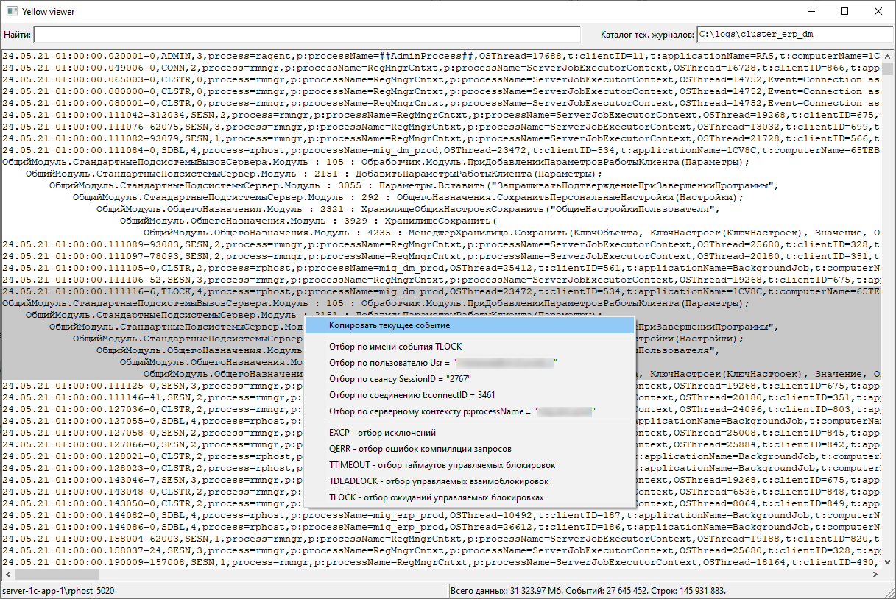
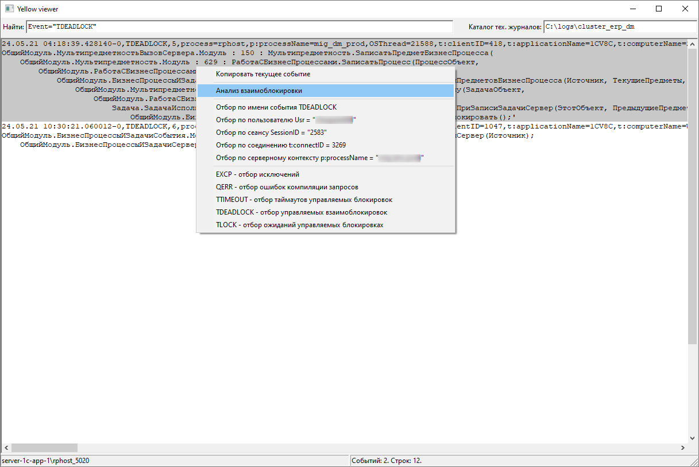

# YellowViewer
Viewing files of technological logs 1C (WinAPI)
1C technological log files viewer (WinAPI). Works with large files. Minimal memory consumption when indexing data, viewing. Analysis of managed deadlocks, timeouts, waits. Filters by events, period, users, connections, sessions.
  - Works with large files.
  - Minimal memory consumption when indexing data, viewing.
  - Analysis of managed deadlocks, timeouts, waits.
  - Filters by events, period, users, connections, sessions.
  - Sorting events by time from different working servers of the 1C cluster.
  - Displaying the working server in the status bar for the tech. log event.
  - Visual highlighting of the current event.

## Highlighting of the current event

## Deadlock analysis

## Wait timeout analysis

